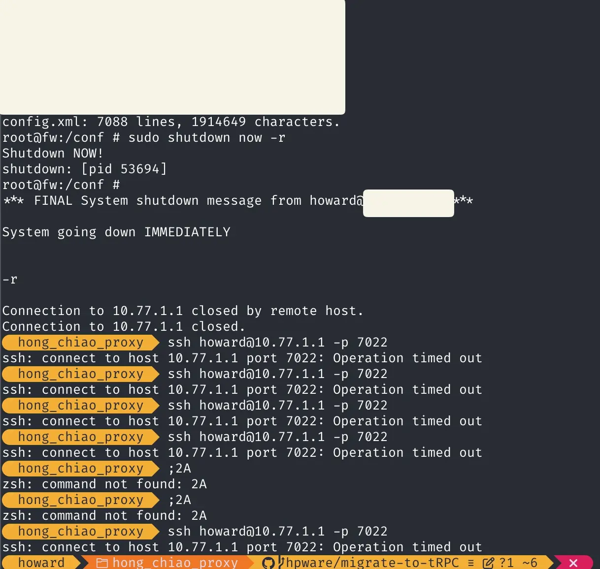

# 防火牆為什麼會掛掉?

主要是我在 LAN 上更改 IPv6 設定登不進去管理介面後跑 `shutdown now -r` 然後就掛了...
然後其他的 Routing 功能都正常

# 之後怎麼恢復的?

idk man, 我按一下機器的開機鍵就好了

# 啊之前說要修的 DNS 勒?

沒時間修 :(

然後之前說的網頁系統跟根本還沒設定完

# Threads 文

[ㄧ](https://www.threads.net/@yh._.5/post/Danqrqjmm-r), [二](https://www.threads.com/@yh._.5/post/DanrXZtmjZa), [三](https://www.threads.com/@yh._.5/post/DansuuJmtt-), [四](https://www.threads.com/@yh._.5/post/DaoyDrVmrtA)
