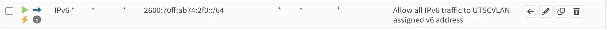

# What happened?

During a system upgrade operation, I found out ALL IPv6 addresses ARE OPEN TO THE WORLD WIDE WEB! This is a mistake on my end with this shitty role. In the future every internal IPv6 would

# Does this effect manageut users?

No. In fact, by default every MANAGEUT users' servers are open to the world with IPv6. This is intentional.

# Why now?

Zeabur just got hacked. So I checked my home lab, and I'm upgrading my Dokploy server.
